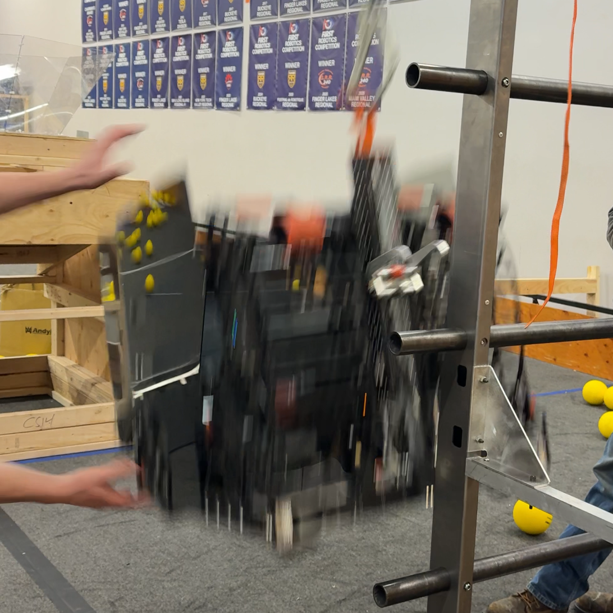

# Rebuilt2026-340

FRC Team 340's code for the 2026 season, REBUILT.

### Highlights

- **Auto-aim with Shoot On The Move**

    The robot aims and shoots at its current target with the press of a single button, and performs additional calculations to compensate for its movement. The robot's target automatically switches depending on its field position.

- **Full Field Localization**

    Using a [Luma P1](https://luma.vision/products/p1) with a [modified instance of PhotonVision](https://github.com/Greater-Rochester-Robotics/photonvision/tree/multitag-mod), the robot combines vision measurements with odometry using a Kalman filter to accurately track its position on the field throughout the entirety of a match.

- **On-the-fly Motion Planning with Obstacle Avoidance**

    The robot utilizes an [artificial potential field](src/main/java/org/team340/lib/math/PAPFController.java) to automatically servo to a specified pose, with the ability to avoid obstacles (i.e. field elements) in its path. This algorithm is used for all movement during the autonomous period, and for automated climbing in teleop.

 

